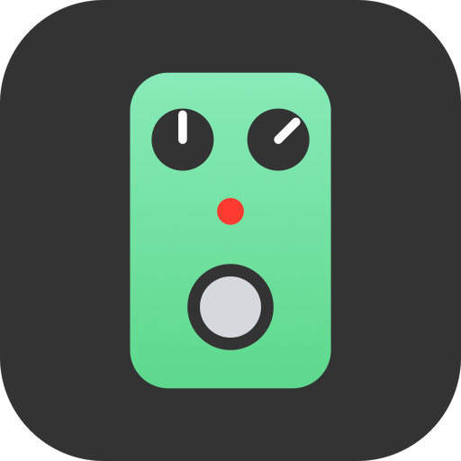
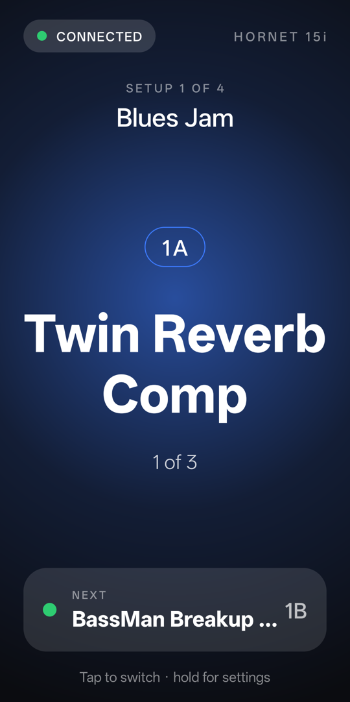
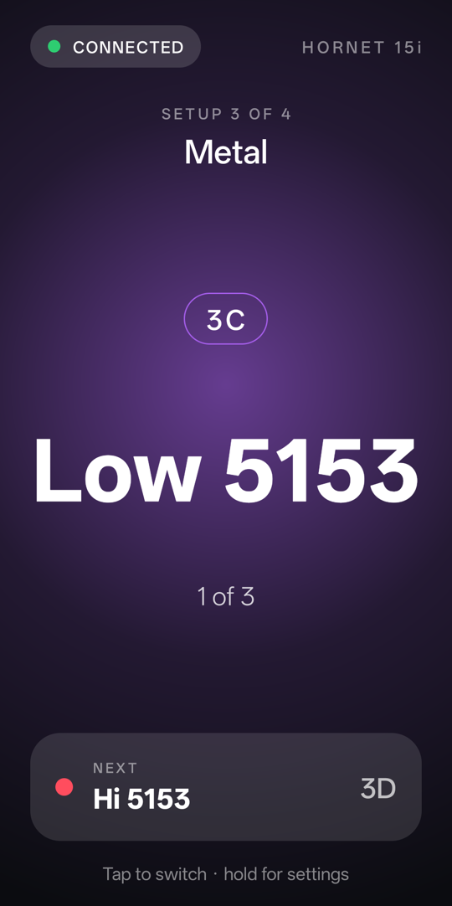
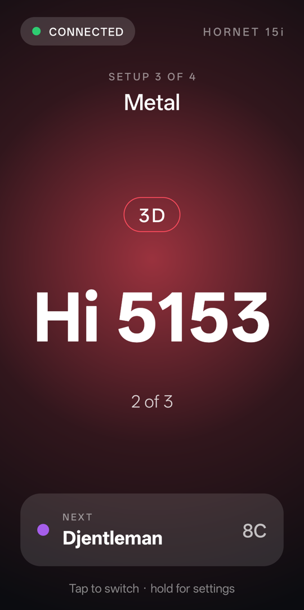
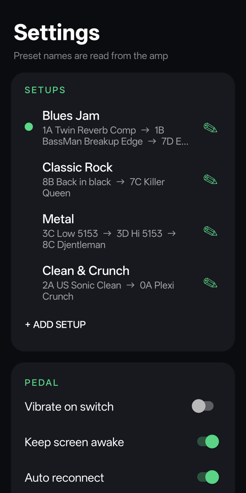
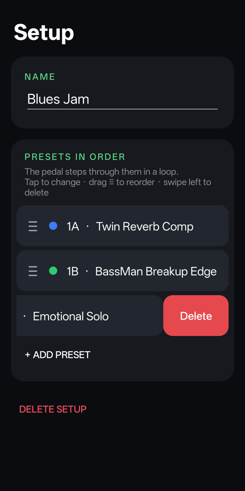
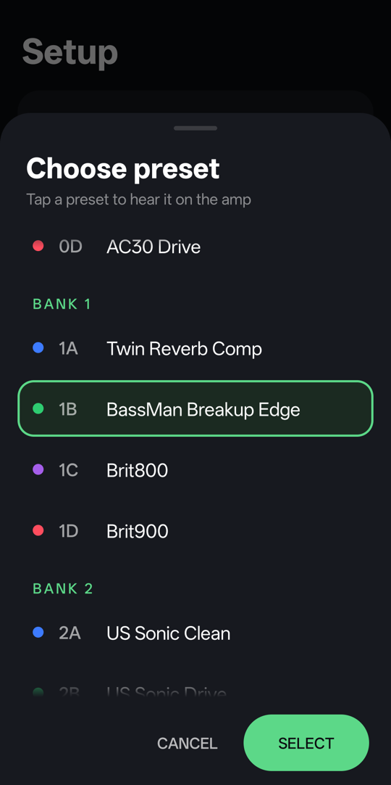
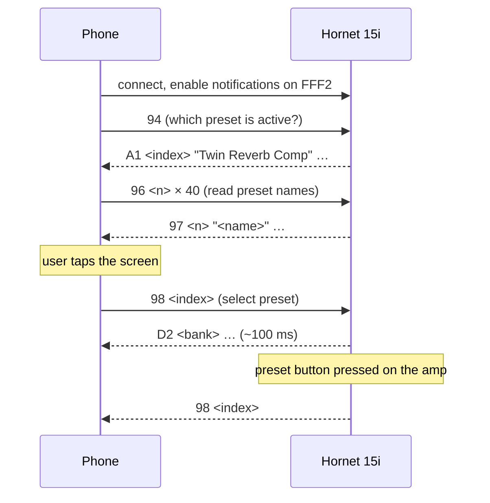

<div align="center">



# Switch for Hornet

**Turn your phone into a big, foot-friendly preset switch for the MOOER Hornet 15i.**

Tap anywhere on the screen — the amp jumps to the next preset you picked. Any presets, any order, from any bank.

<sub>Made with ♥ by <a href="https://github.com/nicksas"><b>@nicksas</b></a></sub>

[](../../releases/latest)


<br>

&nbsp;
&nbsp;


</div>

---

## Why

The Hornet 15i has one preset button, and it only cycles through the four presets of the current bank.
If you want *clean → drive* for the verse and chorus, or a lead sound that lives in another bank, you have to
reach for the official app and dig through menus mid-song.

**Switch for Hornet** gives you a whole-screen footswitch instead. Put the phone on the floor or on a mic stand,
build a list of presets for a song or a rehearsal, and step through them with a single tap.

## Features

- 🎛 **One huge button.** The entire screen is the switch — easy to hit with a hand or a foot.
- 🔁 **Setups.** Make named lists like *Blues Jam* = `1A → 1B → 7D` or *Metal* = `3C → 3D → 8C`. Each tap selects the next preset, looping. One preset, two, or as many as you need.
- 🏷 **Real preset names.** All 40 names are read from the amp, so you see *Twin Reverb Comp*, not just `1A`.
- 🎨 **Matches the amp's light.** The screen glows in the colour of the active slot — A blue, B green, C purple, D red — just like the indicator on the Hornet.
- 🔊 **Audition while you build.** Tapping a preset in the picker switches the amp so you can hear it before saving.
- 🔄 **Stays in sync.** Presses on the amp's own button show up instantly; after a reconnect the app asks the amp what is active.
- 🔌 **Reconnects by itself** after the amp is power-cycled or Bluetooth is toggled, and never jumps to someone else's Hornet on its own.
- 🔒 **Offline & private.** No account, no ads, no analytics, no internet permission.

<div align="center">
&nbsp;
&nbsp;

</div>

## Getting started

1. **Download** the latest APK from [Releases](../../releases/latest) and install it (allow installing from your browser or file manager when Android asks).
2. Turn on the **Hornet 15i**.
3. **Close MOOER iAMP** completely (swipe it away from recent apps) — while iAMP is connected the amp is invisible to other apps.
4. Open **Switch for Hornet** and allow *Nearby devices*. The amp is found and remembered automatically.
5. **Long-press** the screen to open Settings → *Setups* → **+ Add setup**, pick your presets, drag `≡` to reorder.
6. Go back and **tap** to switch.

| Gesture | Where | Action |
|---|---|---|
| Tap | pedal screen | next preset of the current setup |
| Long-press | pedal screen | open Settings |
| Tap a row | Settings → Setups | make that setup current (the amp jumps to its first preset) |
| Tap a preset | setup editor | open the picker — the amp switches to it right away; tapping another preset plays that one |
| Drag `≡` | setup editor | reorder presets |
| Swipe left | setup editor | reveal **Delete** for that preset |

> **Tip:** the app is made to stay open on screen while you play — keep *Keep screen awake* on (default) and the
> phone plugged in for long sessions. With the screen off, Android may pause or close the app.

## How it works

The Hornet 15i exposes a simple BLE GATT service. The app writes commands to one characteristic and listens for
notifications on another — the same commands the official app sends. No pairing, no handshake.



Every frame looks like this:

```
AA 55 | len (uint16 LE) | cmd | payload | CRC-16/GSM (BE)
select 1C:  AA 55 02 00 98 06 E3 13        index = bank × 4 + slot
```

The full reverse-engineered protocol — characteristics, commands, replies, CRC and captured examples — is in
**[PROTOCOL.md](PROTOCOL.md)**. Real-device test results are in **[TEST_REPORT.md](TEST_REPORT.md)**.

## Compatibility

| | Status |
|---|---|
| MOOER Hornet 15i, firmware V1.1.8 | ✅ verified (100/100 switches, median latency ~100 ms) |
| Other Hornet 15i firmware versions | ❓ untested — very likely the same protocol |
| Hornet 05i / 30i and other MOOER amps | ❓ untested |
| Android 12 – 16 | ✅ tested on Android 16 (OPPO); Android 12+ required for the BLE permissions used |

Got a different firmware, model or phone? Please [open an issue](../../issues) with your amp's firmware version
and the log from *Settings → Export log* — it helps a lot.

## Build from source

Requirements: JDK 17+ (the one bundled with Android Studio works) and the Android SDK (platform 35).

```bash
git clone https://github.com/nicksas/switch-for-hornet.git
cd switch-for-hornet
./gradlew testDebugUnitTest assembleDebug
adb install -r app/build/outputs/apk/debug/app-debug.apk
```

Open the folder in Android Studio, or point Gradle at your SDK with `ANDROID_HOME` / `local.properties`.
Release builds are signed with `.private/keystore.properties` + `.private/release.jks` when present (not in the repo);
without them the release APK is left unsigned.

<details>
<summary><b>Project structure</b></summary>

| Path | What |
|---|---|
| `app/src/main/java/dev/hornetswitch/HornetProtocol.kt` | frame codec, CRC, notification parsing — pure Kotlin, unit-tested |
| `app/src/main/java/dev/hornetswitch/HornetBleClient.kt` | scanning, GATT, reconnects, name reading, diagnostic log |
| `app/src/main/java/dev/hornetswitch/MainActivity.kt` | the pedal screen |
| `app/src/main/java/dev/hornetswitch/SettingsActivity.kt` | settings and the list of setups |
| `app/src/main/java/dev/hornetswitch/SetupActivity.kt` | setup editor and preset picker |
| `app/src/test/…/HornetProtocolTest.kt` | codec tests against captured packets |
| `research/hornet_test.py` | tiny desktop test client (Python + [bleak](https://github.com/hbldh/bleak)) |
| `research/*.txt` | raw capture and test logs referenced by the docs |

</details>

## Disclaimer

Switch for Hornet is an independent, unofficial project. It is **not affiliated with, endorsed by or supported by
MOOER Audio**. "MOOER", "Hornet" and "iAMP" are trademarks of their respective owners and are used here only to
describe compatibility.

The protocol was worked out for interoperability by observing the commands the official app sends. The app only
sends those same documented commands (select preset, read preset, get active preset) — it never writes settings
or firmware. Use at your own risk.

## License

[MIT](LICENSE) © 2026 [nicksas](https://github.com/nicksas)

<div align="center">
<sub>Built by a guitarist who just wanted a bigger button 🎸</sub>
</div>
